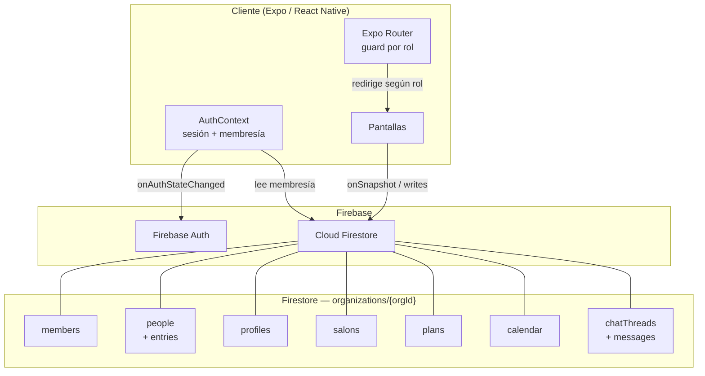

# Bitácora App

Aplicación multiplataforma (iOS · Android · Web) para la gestión integral de organizaciones que trabajan con participantes: jardines infantiles, hogares de adultos mayores, gimnasios, profesionales a domicilio, etc. Construida con **Expo / React Native**, **Expo Router** y **Firebase** (Auth + Firestore).

---

## Arquitectura general



---

## Stack tecnológico

| Capa | Tecnología |
|---|---|
| Framework UI | React Native 0.76 + Expo 52 |
| Navegación | Expo Router 4 (file-based) |
| Backend / DB | Firebase 10 (Auth + Firestore) |
| Estilos | StyleSheet nativo + tokens (`src/theme.ts`) |
| Lenguaje | TypeScript 5.3 |
| Web | React Native Web + Vercel (`vercel.json`) |
| Build móvil | EAS Build (iOS / Android) |

---

## Funcionalidades implementadas

### Autenticación y onboarding
- Login con imagen de fondo y overlay.
- Wizard de alta inicial: el primer usuario crea la organización, elige el rubro/categoría de negocio y queda como `admin`.
- Redirección automática según estado de sesión y membresía (`/login` → `/setup` → `/`).
- Aprovisionamiento de cuentas secundarias (profesionales, apoderados) desde el panel admin sin cerrar la sesión activa (app Firebase secundaria temporal).

### Roles y acceso
Cinco roles con permisos progresivos:

| Rol | Descripción |
|---|---|
| `admin` | Acceso total: organización, perfiles, participantes, salones, planes, calendario, chat |
| `editor` | Gestión de participantes asignados, registro de bitácoras, calendario, chat |
| `profesional` | Igual que editor; se distingue en la lógica de chat (nombre del salón como remitente) |
| `lector` / `lectura` | Apoderado: solo ve a sus participantes vinculados y sus registros (solo lectura) |

### Panel Admin (`/admin`)
- Dashboard con checklist de configuración y barra de progreso.
- Resumen de salones, planes, profesionales y participantes activos.

### Perfiles de profesionales (`/admin/perfiles`)
- CRUD completo con campos: nombre, cargo, nacionalidad, fecha de nacimiento, RUT (validado formato chileno), dirección, comuna, teléfono, correo personal.
- Contacto de emergencia con parentesco (lista configurable: Padre, Madre, Padrastro, Madrastra, Tutor/a, Pareja, Cónyuge, Abuela, Abuelo, etc.).
- Asignación a múltiples salones mediante buscador con chips.
- Creación de cuenta de acceso vinculada (aprovisionamiento sin cerrar sesión admin); muestra el correo de acceso en la lista.

### Participantes (`/admin/participantes`)
- CRUD con ficha técnica dinámica por categoría de negocio (jardín infantil: datos del niño, apoderados, contactos de emergencia, salud, administrativo).
- Asignación a plan económico (buscador con chip) y a salones (buscador con chips).
- Restauración de ficha desde la plantilla del rubro.
- Creación de cuenta de apoderado/lector vinculada al participante.
- Muestra correo de acceso vinculado; validación de formato de correo y RUT.

### Salones (`/admin/salones`)
- CRUD con jornada configurable: mañana / tarde / extendida, con horarios de inicio y término.
- Capacidad máxima y nivel educativo (sala cuna menor/mayor, medio menor/mayor, pre-kínder, kínder).
- Sincronización automática de `participantIds` y `professionalIds` al guardar.

### Planes económicos (`/admin/planes`)
- CRUD con costo, período (mensual / trimestral / anual) y fecha de vigencia (datepicker).

### Bitácoras / Registros (`/editor`, `/person/[id]`)
- Creación de registros por participante usando las secciones de la plantilla del rubro.
- Registros inmutables una vez creados (trazabilidad tipo bitácora; `allow update, delete: if false` en Firestore).
- Acceso restringido: editores y profesionales solo ven sus participantes asignados.

### Calendario (`/calendario`)
- Grilla mensual estilo papel cuadriculado con columnas de fin de semana resaltadas.
- Eventos con tres tipos de recurrencia: puntual (`single`), rango de fechas (`range`), repetición diaria (`daily`).
- Hora de inicio y fin; vista diaria por tramos horarios.
- Chips de hora junto al título del evento en la grilla mensual.
- Filtro por alcance: global o por salón.
- Permisos: todos leen; admin / editor / profesional crean y editan; solo admin o el propio creador borran.

### Chat (`/chat`)
- Hilos con tres alcances: `global`, `salon`, `participant`.
- Formulario de creación con selector de participante (alcance `participant`): agrega automáticamente el UID del apoderado vinculado a `memberIds`.
- Buscador unificado de miembros: profesionales, participantes y apoderados en un solo campo.
- Chips de miembros en la cabecera del hilo; gestión de agregar / quitar miembros desde el hilo.
- Confirmación de lectura por mensaje (flecha + hora en mensajes propios).
- Editores y profesionales en hilos de salón firman como el nombre del salón.
- Consulta Firestore filtrada por `memberIds` para no-admins (compatible con las reglas de seguridad).

### Panel Apoderado (`/apoderado`)
- Lista de participantes vinculados al UID del apoderado.
- Vista de registros de bitácora del participante en modo solo lectura.
- Acceso al chat para ver hilos en los que fue incluido como miembro.

### UI / UX global
- Breadcrumb `Inicio › … › Página actual` en todas las pantallas con nombre y logo de la organización.
- Snackbar animado (spring) de confirmación de guardado.
- Componentes reutilizables: `DateField`, `TimeField`, `DropdownSelect`, `SectionField`, `EntryCard`, `PersonCard`.
- Loading en botones durante operaciones asíncronas.
- Validación de RUT chileno (formato `XX.XXX.XXX-X`) y correo electrónico en todos los inputs relevantes.

---

## Reglas de seguridad Firestore

Las reglas se encuentran en [`firestore.rules`](firestore.rules). El modelo completo se basa en dos funciones auxiliares evaluadas en cada acceso:

```
esMiembro(orgId)  →  exists(organizations/{orgId}/members/{uid})
miRol(orgId)      →  get(organizations/{orgId}/members/{uid}).data.role
```

| Colección | Leer | Crear | Actualizar | Borrar |
|---|---|---|---|---|
| `users/{uid}` | Propio uid | Propio uid o admin de la org | Igual | — |
| `organizations/{orgId}` | Miembros | Quien pone su uid en `createdBy` | Admin | Admin |
| `members/{memberId}` | Miembros + propio | Primer admin del wizard o admin existente | Admin | Admin |
| `people/{personId}` | Miembros | Admin / editor / profesional | Admin / editor / profesional | Admin / editor / profesional |
| `people/.../entries/{entryId}` | Miembros | Admin / editor / profesional | ❌ nunca | ❌ nunca |
| `profiles/{profileId}` | Miembros | Admin | Admin | Admin |
| `plans/{planId}` | Admin | Admin | Admin | Admin |
| `salons/{salonId}` | Miembros | Admin | Admin | Admin |
| `calendar/{eventId}` | Miembros | Admin / editor / profesional | Admin / editor / profesional | Admin o creador |
| `chatThreads/{threadId}` | Admin (todo) o miembro del hilo | Admin / editor / profesional | Admin: libre; editor/profesional miembro: solo `memberIds`; cualquier miembro: solo `readBy` | Admin |
| `chatThreads/.../messages/{messageId}` | Admin o miembro del hilo | Admin o miembro del hilo (con `authorUid` verificado) | ❌ nunca | ❌ nunca |

> Los registros de bitácora (`entries`) son inmutables por diseño para garantizar trazabilidad. Los mensajes de chat tampoco se pueden editar ni borrar.

---

## Estructura del repositorio

```
app/
  _layout.tsx                    Layout raíz + AuthProvider
  login.tsx                      Inicio de sesión
  register.tsx                   Registro de cuenta
  setup.tsx                      Wizard de alta de organización
  (app)/
    _layout.tsx                  Guard de sesión y membresía
    index.tsx                    Inicio / dashboard
    calendario.tsx               Calendario mensual + diario
    plantilla.tsx                Vista de plantilla
    admin/
      dashboard.tsx              Resumen y checklist de configuración
      participantes.tsx          CRUD participantes
      perfiles.tsx               CRUD profesionales
      salones.tsx                CRUD salones
      planes.tsx                 CRUD planes económicos
      organizacion.tsx           Datos de la organización
    apoderado/
      index.tsx                  Panel apoderado
      participante/[id].tsx      Ficha + registros del participante (solo lectura)
    editor/
      index.tsx                  Lista de participantes del profesional
      participante/[id]/
        index.tsx                Ficha + registros
        nuevo-registro.tsx       Nuevo registro de bitácora
    chat/
      index.tsx                  Lista de hilos
      [threadId].tsx             Hilo de conversación
    person/[id]/
      index.tsx                  Ficha de persona
      nuevo-registro.tsx         Nuevo registro
src/
  firebase.ts                    Inicialización Firebase
  theme.ts                       Tokens de diseño (colores, espaciado, radios)
  types.ts                       Tipos TypeScript del dominio
  context/
    AuthContext.tsx               Sesión, membresía y organización
    SnackbarContext.tsx           Snackbar global
  components/                    Componentes reutilizables
  data/
    adminRepository.ts           Perfiles, participantes, salones, planes
    chatRepository.ts            Hilos y mensajes de chat
    calendarRepository.ts        Eventos del calendario
    entriesRepository.ts         Registros de bitácora
    accountProvisioning.ts       Alta de cuentas secundarias
    accountManagement.ts         Gestión de cuentas
    businessCatalog.ts           Catálogo de categorías y plantillas
    organizationSetup.ts         Wizard de configuración
  utils/
    rut.ts                       Validación y formato RUT chileno
    email.ts                     Validación de correo
    date.ts                      Utilidades de fecha
firestore.rules                  Reglas de seguridad Firestore
docs/
  bitacora-historias-usuario.md  Especificación funcional (historias de usuario)
```

---

## Instalación y configuración

```bash
npm install
npx expo install --fix
```

Crea un archivo `.env` en la raíz con las credenciales de tu proyecto Firebase:

```env
EXPO_PUBLIC_FIREBASE_API_KEY=...
EXPO_PUBLIC_FIREBASE_AUTH_DOMAIN=...
EXPO_PUBLIC_FIREBASE_PROJECT_ID=...
EXPO_PUBLIC_FIREBASE_STORAGE_BUCKET=...
EXPO_PUBLIC_FIREBASE_MESSAGING_SENDER_ID=...
EXPO_PUBLIC_FIREBASE_APP_ID=...
```

## Desarrollo local

```bash
npx expo start
# o
npm run start
```

## Despliegue

### Web (Vercel)
```bash
npm run build:web
# o directamente desde el dashboard de Vercel apuntando al repositorio
```

### Móvil (EAS Build)
```bash
npm install -g eas-cli
eas login
eas build:configure
eas build --platform ios
eas build --platform android
```
